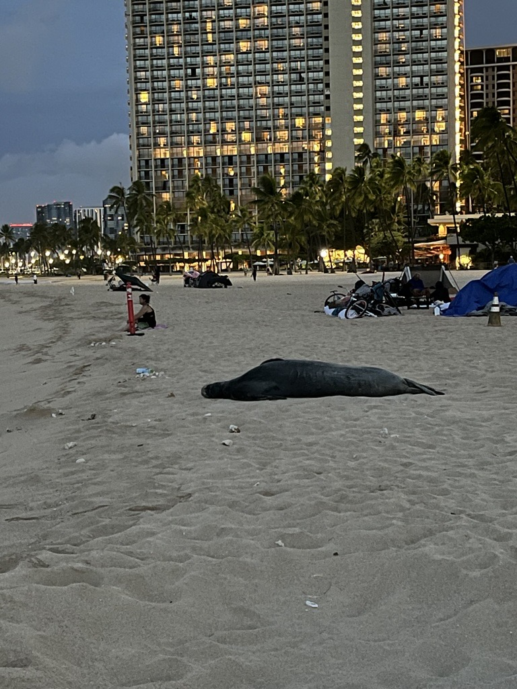

感恩节前夕和六六一起错峰去了夏威夷，在欧胡岛和大岛度过了愉快的8天7晚。照片固然能捕捉精彩瞬间，但希望能借助文字的力量封存一些细节，记录一些感悟，于是写下这篇游记（liu shui zhang）。

## Day 1 – 抵达檀香山

凌晨4点我们就从家里打车去机场了，从Indy飞往休斯顿转机，经过长达8小时的飞行，我们终于抵达了Honolulu。落地后是当地时间下午2点，正是午后阳光明媚的时候，温度适宜。在机场取好车以后我们的夏威夷之行就开启了。

{width="80%"}

从机场前往Waikīkī沙滩的路上非常堵车，一开始看到的房子都是低矮老旧的，但是越靠近Waikīkī就出现更多现代的高楼大厦，大多数都是酒店，同时也包含了购物中心和会议中心。这次我们在Oahu岛入住的是IHG旗下的Holiday Inn，原因是拥有Chase IHG的信用卡赠送的五晚free night。但房间非常的狭小，小到我们的行李箱刚好能展开，这是我们整个旅途的槽点之一。这让我想起了以前在日本入住的酒店也是狭小无比，果然在夏威夷这样一个日本文化丰富的地方，连酒店也继承了"日式风格"。

去酒店check in以后我们就直奔Ala Moana Shopping Center，这里是整个夏威夷最大的购物中心，拥有众多奢侈品牌。夏威夷不仅是一个度假胜地，更是全美消费税最低的地方之一，所以前来这里购物的人很多，我们也在这里给六六买到了喜爱的生日礼物。中途我们还偶遇了一个夏威夷风格的舞台表演，演员们具有Pacific Islander特有的黝黑亚裔面孔，欢快的舞蹈和音乐让我们感受到了夏威夷对我们的热情欢迎。

::: {.callout-note title="冷知识"}
夏威夷实际上没有传统意义上的"sales tax"（销售税）。取而代之的是General Excise Tax (GET，一般消费税/营业税)——对几乎所有商业活动（包括商品销售、服务、租赁等）征税。GET的税率为4%，但对于某些县（如檀香山所在的欧胡岛）会额外征收0.5%的县级税。因此，在欧胡岛购物时，实际的总税率为4.5%。对比全国平均水平（大约≈7.5%–7.7%的combined sales tax率）来看，夏威夷的4%–4.5%远低于平均水平。
:::

作为川渝人我们在夏威夷的第一顿饭当然是去川菜馆，去的是很多人推荐的滋味成都Chengdu Taste，到了店里我才意识到22年初来夏威夷的时候也来了这一家店。我们点了名气很大的钵钵鸡，卖相很好但味道一般，和超市买调料自己做的味道差不多。相反我们觉得最好吃的是一道素菜炝炒莲白，两人一顿狂炫直接光盘。

## Day 2 – 钻石山与北岸

因为时差原因我们凌晨3点多就醒了，5点天还没亮我们决定从酒店走到Waikīkī沙滩散步（10分钟步行距离）。沙滩上能看到一些帐篷，里面是还在熟睡的流浪汉，大海望去漆黑一片，只能听到舒缓有节奏的海浪声，空气里也没有在其他美国城市闻到的"流浪汉味"，取而代之的是大海独有的咸腥。在沙滩上我们还惊喜地看见了一只seal，它翻身熟睡的样子让我们十分嫉妒其没有时差的困扰。

酒店吃完早饭以后我们去了Diamond Head钻石山，这是绝大部分来欧胡岛的人都会打卡的景点。徒步上山以后能俯瞰大海和整个Waikiki沙滩，远处是蔚蓝无垠的大海与天空，以及一条笔直的分界线，近处是沙滩上层次栉比的高楼大厦，这样的融合是Honolulu这座海边城市独有的景色。

从钻石山下来以后我们又一路驱车去了欧胡岛的北岸，吃了名气很大的虾饭，但是味道真的很一般，米饭煮得太软烂，而且过于油腻，就餐环境也很差，不是很懂为什么这么多人推荐。之后在北岸的沙滩上玩了一会水，当天下午的天气多云，海浪很大。浪花拍打在岸边显得十分凶狠，让人不得不对大海的力量产生畏惧。

晚上为了庆祝六六生日我们吃了一家Omakase，老板是一个非常热情的亚裔小哥。全程一共15道菜，我们最爱的是海胆和鱼子酱，味道十分鲜美。巧合的是当天10个客人里面还有一位寿星，老板制作了一道点着蜡烛的寿星专属sushi，在大家欢快生日歌声中我们结束了这一天的旅程。

## Day 3 – Koko Crater与古兰妮牧场

上午去爬了Koko Crater Trail，全程都是旧军用铁路木枕头阶梯，根据阶梯上标记的数字显示共1174级，非常陡峭。尽管如此，路上不乏抱着婴幼儿徒步的父母，也有爬行迟缓但意志坚定的老人，更有已经往返5次的硬汉。山顶可以俯瞰整个恐龙湾Hanauma Bay，能看出来恐龙的轮廓，十分壮观。

::: {.callout-note title="冷知识"}
**"Hanauma"的真正含义**

来自夏威夷语： - Hana = 海湾/入口 - Uma = 鼻梁或弯曲的形状
:::

下午我们去了古兰妮牧场，上次来这里我玩了越野车自驾（ATV tour），这次和六六我们报的是滑索zip lining。Tour的起点需要驱车到达，途中经过的山谷巍峨险峻，沿途路过各种电影的拍摄地点，最有名的还是侏罗纪世界。整个tour一共有7段滑索，从山谷一侧荡到对侧的过程十分惊险刺激，但同时看到的风景也非常壮观，尖叫声在山谷间回荡，沉浸式体验带来自由的感觉。有趣的是其中最长的滑索对于体重较轻的人来说可能没法到达对岸，所以需要身体蜷住抱膝减少阻力，并且工作人员需要在起点用力"摔"出去给予一定的初速度，这被生动形象地比喻为"tumble coconut"。

## Day 4 – 恐龙湾浮潜与飞往大岛

这是我们在欧胡岛的最后一天，天气终于转晴。如果说多云时大海展现的阴沉与汹涌像一位孔武有力的勇士，那么晴天下的大海则像平静温和的公主，明亮的宝石蓝才是其底色。天气好沙滩上多了更多晒太阳的人，海上也能看到有人冲浪、玩帆船。午后我们也趁机加入了水上运动——浮潜。恐龙湾是新手浮潜的圣地，我们也看到了很多各色的鱼和珊瑚。漂在水里眺望大海会有一种安全感，仿佛自己被海湾保护着，想必那些鱼儿也有类似的感受吧。

傍晚我们飞往了夏威夷四个主要岛屿的另一个：Island of Hawaii（大岛），开启了我们接下来的大岛之旅。

## Day 5 – 大岛浮潜与海洋生物

大岛第一天我们继续去玩了浮潜，与前一天恐龙湾不同，在大岛的浮潜我们报了tour乘船去了两个不同的海湾，这里人少得多，鱼类也会更丰富。惊喜的是，我们8点出船以后不久就看到了海豚群。这些聪明的海洋精灵跟着我们的船游了很久，身姿在明净的水里清晰可见，并且时不时在旁边跳出水翻越几下，十分快活。



到达浮潜地后我们是从船上入水，船员特意强调这里的水深我们不能像在恐龙湾一样站起来，相反，如果游去浅滩站起来会十分危险。在这里水更为清澈，我们也看到了更多样的鱼类与珊瑚，五彩斑斓，还有珊瑚深处大小各异带刺的黑色海胆。坐船返程的路上还在远处海面看到了飞鱼，以及近处的manta，时不时我们也停下来观察海岸边火山喷发形成的洞穴。我们的小船上包含船员尽管只坐了9个人，但惊喜的尖叫与赞叹声却在一路上层出不穷，十分热闹。



下午我们去了大岛的几个海滩散步，看到了在岸边懒洋洋晒太阳的海龟。

大岛第一天海洋生物观赏体验收获满满。

## Day 6 – 火山国家公园探索

这一天我们主要的行程是去火山国家公园，刚好看到美国国家地质官网预测公园内的火山今年第37次爆发就在这两天，所以我们怀有期待地驱车2个多小时前往公园。途中路过了美国领土最南端，岸边有几个渔民正在钓鱼，显得十分惬意。

::: {.callout-note title="冷知识"}
夏威夷大岛的南端点（Ka Lae），是美国本土之外的最南端点，位于夏威夷岛的南端。这个地点标志着美国领土在地理上的最南端位置。
:::

到了公园以后我们先是围着巨大的crater徒步，俯瞰整个火山坑十分壮观，一眼望去是黑灰色的岩石，没有植被覆盖，显得一片死寂，已然可想象滚烫岩浆流淌过时的无情，而右侧便是冒着那无情的源头——冒着白烟的火山口。之后我们又走了另一个trail经过了一片雨林，一个岩浆流过形成的lava tube。雨林尽是绿色，植被丰富，与旁边火山坑的色调形成了巨大的反差，难以想象二者出现在同一个时空。自然总是精准地控制着生态与气候，使得熔岩荒地与热带雨林也能和谐共存。

最后我们还直接下到了火山坑表面，近距离来到这片荒地可以看到不少树苗正在裂缝中顽强地生长，或许未来这里也会长成另一片雨林，亦或许不幸地遇到又一次火山喷发而被烧毁，而后又重生。就这样，毁灭和重生在永恒地更迭。

晚上去到了火山口观景台并没能看到火山喷发的壮景，加上温度实在太低，我们便略带落寞地离开了公园。

## Day 7 – 北部海岸线与火山喷发奇观

由于前一天玩得有些疲惫，这天我们打算走悠闲路线，于是从Kona一路向北，沿着海岸线行驶，途中遇见沙滩或者公园就停下来看看。一直到北边的小镇Hawi两人吃了一份Poke当作午饭，尽管鱼肉新鲜，但无奈味道太咸。镇上还有很多小店，里面藏有不少精致而昂贵的手工艺品和艺术品。

午后我们前往了Pololu山谷，一路徒步下山可以走到一片黑沙滩，沿途可以看到海边层叠的悬崖峭壁，十分壮观。而走到黑沙滩以后发现背后就是雾气腾腾的山谷，远处可见一群牛正在悠闲地享用自己的下午茶。

 

之后我们本来计划前往天文台看云海日落，但4点左右突然得知火山正在喷发，和六六商量片刻当即决定再次前往火山公园。一路除了一次加油以外马不停蹄，抵达公园附近发现天空已经泛红，更加剧了我们紧张的心情，生怕错过。终于驱车2个半小时后我们顺利抵达了火山口观景台，当即被眼前的一幕震撼。

滚烫的岩浆正从昨天那个冒着白烟的火山口喷涌而出，之后迅速地向山下汹涌，但是速度越来越慢，中间的干流像一条金色的绸带，上面又嵌有火红的纹路，一直延伸到火山坑的边缘。火山坑的裂缝也被岩浆支流填满，六六说像从飞机上看见的城市夜景。尽管视觉的冲击是最主要的，但同时我们也能感受到火焰的温度，嗅到含硫气体的味道，以及耳边间断低沉的轰鸣，这样的体验毕生难忘。

后来得知这场喷发持续了9个小时之久，那晚仿佛整个海岛都被照亮，所有的生灵都在虔诚地敬畏着这场来自大地最深处的能量爆发。

## Day 8 – 启程回家

在大岛最后一天我们入住了Outrigger Resort，酒店每天都有不同的活动。我们当天是有Farmer's Market，既有新鲜瓜果，也有手工艺品，十分热闹。上午在海边惬意地吃了一顿早餐，我们便前往Kona机场准备启程回家了。Kona机场并没有传统的气派航站楼，而是几个低矮的房子，四面透着海风，有着原始的海岛风情，这应该是全世界建设及维护成本最低的国际机场之一了。

------------------------------------------------------------------------

8天7晚的夏威夷之旅很快画上了句号，有阳光沙滩的惬意，也有徒步旅行的疲惫；有目睹火山喷发的震撼，也有错过云海星空的遗憾；有尽观海洋生物的惊喜，也有对食物的差强人意……旅行就是这样，好与不好都是我们走过的路,有缺憾才能更加期待下一次出发。